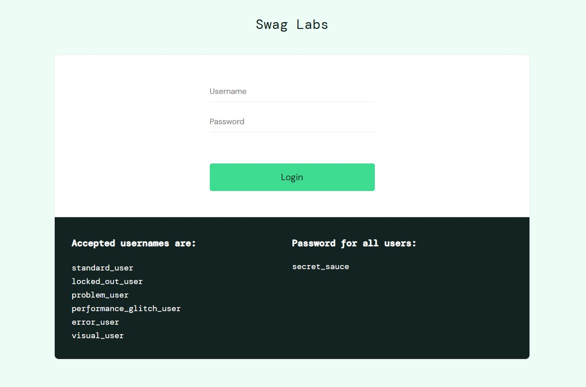
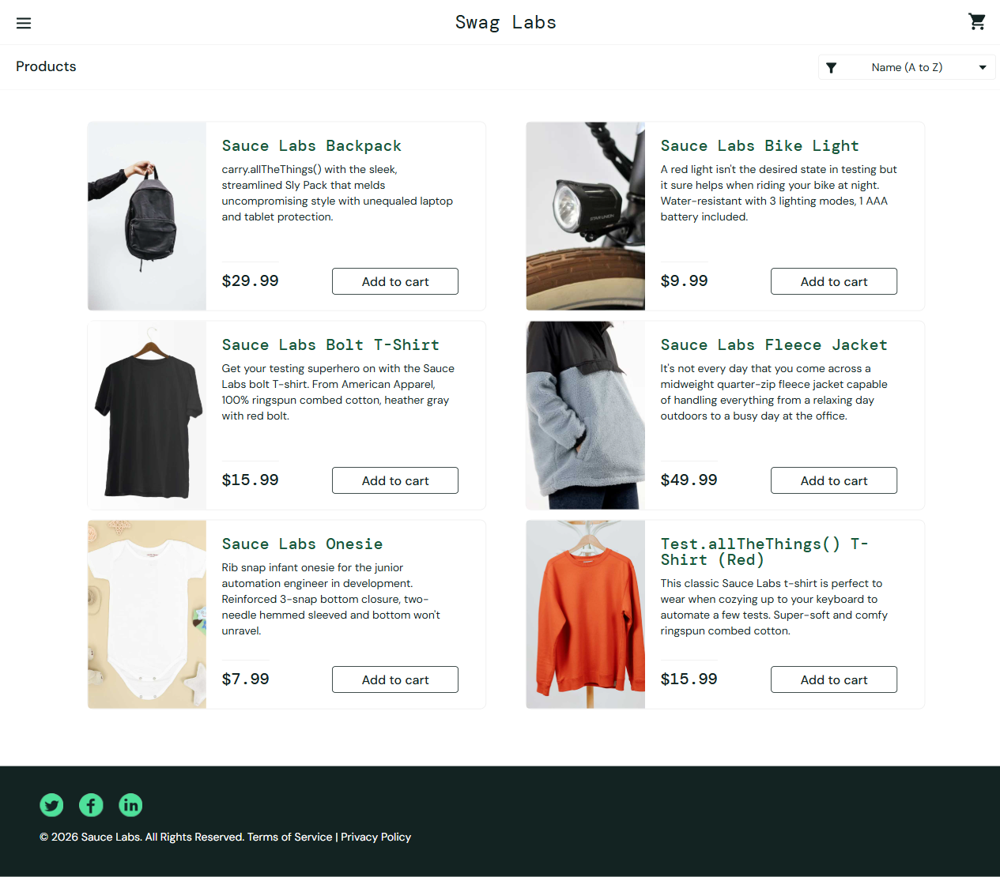
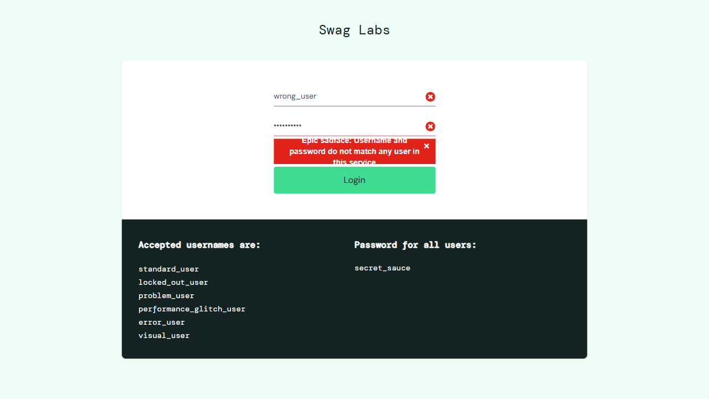

# Playwright Login Automation Framework
This project is an automated testing framework built using Playwright to validate the login functionality of a web application(SauceDemo). It follows industry best practices to ensure scalability, maintainability, and reliability.

## Project Overview
- Automated testing of the SauceDemo login functionality
- Implemented using Page Object Model (POM) design pattern
- Designed for reusable and scalable test architecture
- Helps ensure login stability and error handling validation

## Tech Stack
- Playwright
- JavaScript
- Node.js

## Project Structure
```bash
tests/
│── login.spec.js          # Test cases
│── loginPage.js           # Page Object Model (Login Page)
│── loginCredentials.js    # Test data / credentials
```

## Features
- Page Object Model (POM) architecture
- Clean and reusable code structure
- Easy to maintain and extend
- Fast and reliable execution
- Scalable for large automation projects
- Supports cross-browser testing (Playwright feature) 

## screenshots
  ### Login Page


### Successful Login


### Failed Login


## How to Run
```bash
1. Install dependencies:
npm install
2. Execute tests:
npx playwright test
```
